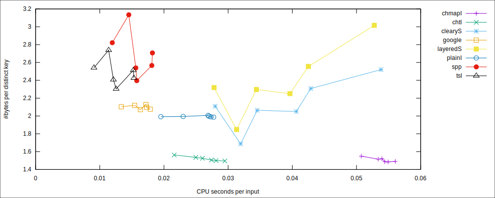

## Getting Started
```sh
git clone https://github.com/koeppl/udb2
cd udb2
# compile directories that include the library code; C++17 required for some libraries
make
# run benchmarks for compiled programs
./run.sh
```

## Introduction

This repo is derived from [attractivechaos/udb2](https://github.com/attractivechaos/udb2), which
implements a *micro*-benchmark to evaluate the performance of various
hashtable libraries in C/C++. Each library is given *N* 32-bit integers with
~25% of them are distinct. The task is to find the occurrence of each distinct
integer with a dictionary. To show the effect of rehashing, the benchmark
program runs the task for six rounds with *N* set to 10, 18, 26, 34, 42 and 50
million, respectively.

Each directory in this repo typically corresponds to one library. Directories
*not* prefixed with underscores include the library source code and can be
compiled without external dependencies (warning: most C++ libraries require
C++11). Directories prefixed with underscores require third-party libraries or
compiler-specific extensions. They are not compiled when you type `make`. You
have to install the external dependencies first and then compile manually by
yourself.

## Results

Complete results can be found in the [\_logs][rst] directory. 
The following figure shows the memory vs runtime when the benchmark is run on 
a Ubuntu Linux 18.04 machine equipped with an Intel Xeon CPU E3-1271 v3 clocked at 3.60GHz 
and with 32 GiB of RAM:



The used hash tables are:
 * [spp](https://github.com/greg7mdp/sparsepp); Gregory Popovitch's Sparsepp
 * [google](https://github.com/sparsehash/sparsehash): Google's sparse hash table
 * [tsl](https://github.com/Tessil/sparse-map): Tessil's sparse map
 * layeredS, clearyS: [sparse compact hash tables](https://github.com/tudocomp/compact_sparse_hash) from the tudocomp project
 * plainI, chtI, chmapI: [separate chaining hash tables](https://github.com/koeppl/separate_chaining)


The [companion blog post][blog] gives more background about this benchmark.

[rst]: https://github.com/koeppl/udb2/tree/master/__logs
[blog]: https://attractivechaos.wordpress.com/2018/01/13/revisiting-hash-table-performance/
